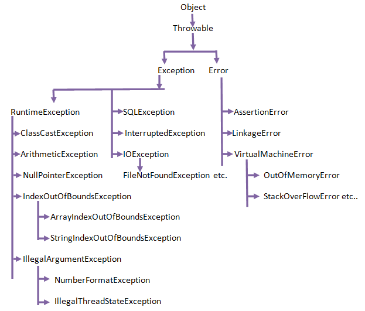

# Checked Exception vs Unchecked Exception

## Checked Exception

* On **Compile Time**
* Must be handled \(try-catch or throw upper\)

## Unchecked Exception \(Runtime Exception\)

* On **Runtime**
* Not necessarily handled

## References





